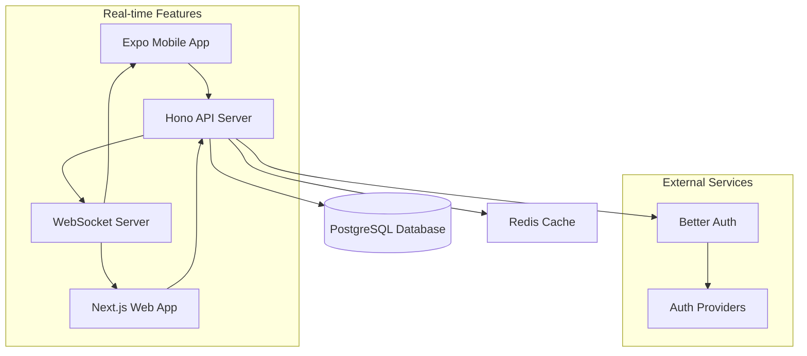

# Design Document

## Overview

The meal planner application is designed as a mobile-first collaborative household management system built on a modern full-stack architecture. The system leverages your existing Turborepo monorepo structure with Expo for mobile development, Hono for the API backend, and Prisma with PostgreSQL for data persistence. The architecture emphasizes real-time collaboration, offline-first mobile experience, and seamless synchronization between meal planning and inventory management.

## Architecture

### High-Level Architecture



### Technology Stack

- **Frontend (Mobile)**: Expo Router, React Native, TypeScript
- **Frontend (Web)**: Next.js, React, TypeScript (for admin/desktop use)
- **Backend API**: Hono, TypeScript, Node.js
- **Authentication**: Better Auth with multiple providers
- **Database**: PostgreSQL with Prisma ORM
- **Real-time**: WebSockets for live collaboration
- **Caching**: Redis for session management and real-time data
- **Build System**: Turborepo for monorepo management

## Components and Interfaces

### Mobile Application Components

#### Authentication Module

- **LoginScreen**: Better Auth integration with provider selection
- **AuthProvider**: Context provider for authentication state management
- **ProtectedRoute**: Route wrapper for authenticated access

#### Household Management

- **HouseholdSelector**: Switch between multiple households
- **HouseholdSettings**: Manage household details and members
- **InviteManager**: Send and manage household invitations
- **MemberList**: Display and manage household members

#### Inventory Management

- **InventoryList**: Categorized display of household inventory
- **InventoryItem**: Individual item component with quantity controls
- **AddItemModal**: Form for adding new inventory items
- **CategoryFilter**: Filter inventory by categories
- **InventorySearch**: Search functionality for inventory items

#### Shopping List

- **ShoppingList**: Real-time collaborative shopping list
- **ShoppingItem**: Individual shopping list item with check-off functionality
- **AddToShoppingModal**: Quick add items to shopping list
- **ShoppingListSync**: Real-time synchronization component

#### Recipe Management

- **RecipeList**: Browse and search recipes
- **RecipeDetail**: Full recipe view with ingredients and instructions
- **RecipeEditor**: Create and edit recipes
- **RecipeSearch**: Search recipes by name, ingredients, or tags

#### Meal Planning

- **WeeklyPlanner**: Calendar view of meal plans
- **MealSlot**: Individual meal slot (breakfast, lunch, dinner)
- **RecipePicker**: Select recipes for meal slots
- **MealPlanSync**: Synchronize meal plans with inventory

### API Endpoints Structure

#### Authentication Routes

```typescript
(/auth/ * // Better Auth routes
  /api/ahtu) /
  session / // Get current session
  api /
  auth /
  logout; // Logout endpoint
```

#### Household Routes

```typescript
/api/households        // GET: List user households, POST: Create household
/api/households/:id    // GET: Get household details, PUT: Update, DELETE: Delete
/api/households/:id/members    // GET: List members, POST: Add member
/api/households/:id/invites    // GET: List invites, POST: Send invite
```

#### Inventory Routes

```typescript
/api/households/:id/inventory          // GET: List inventory, POST: Add item
/api/households/:id/inventory/:itemId  // GET: Get item, PUT: Update, DELETE: Delete
/api/households/:id/inventory/categories // GET: List categories
```

#### Shopping List Routes

```typescript
/api/households/:id/shopping-list      // GET: Get shopping list, POST: Add item
/api/households/:id/shopping-list/:itemId // PUT: Update item, DELETE: Remove item
```

#### Recipe Routes

```typescript
/api/recipes           // GET: List recipes, POST: Create recipe
/api/recipes/:id       // GET: Get recipe, PUT: Update, DELETE: Delete
/api/recipes/search    // GET: Search recipes
```

#### Meal Planning Routes

```typescript
/api/households/:id/meal-plans         // GET: Get meal plans, POST: Create plan
/api/households/:id/meal-plans/:planId // GET: Get plan, PUT: Update, DELETE: Delete
/api/households/:id/meal-plans/:planId/cook // POST: Mark meal as cooked
```

## Data Models

### Core Database Schema

```prisma
model User {
  id          String   @id @default(cuid())
  email       String   @unique
  name        String?
  avatar      String?
  createdAt   DateTime @default(now())
  updatedAt   DateTime @updatedAt

  // Relationships
  householdMembers HouseholdMember[]
  recipes         Recipe[]
  createdHouseholds Household[] @relation("HouseholdCreator")
}

model Household {
  id          String   @id @default(cuid())
  name        String
  description String?
  createdAt   DateTime @default(now())
  updatedAt   DateTime @updatedAt
  creatorId   String

  // Relationships
  creator     User @relation("HouseholdCreator", fields: [creatorId], references: [id])
  members     HouseholdMember[]
  inventory   InventoryItem[]
  shoppingList ShoppingListItem[]
  mealPlans   MealPlan[]
  invites     HouseholdInvite[]
}

model HouseholdMember {
  id          String   @id @default(cuid())
  role        HouseholdRole @default(MEMBER)
  joinedAt    DateTime @default(now())
  userId      String
  householdId String

  // Relationships
  user        User @relation(fields: [userId], references: [id])
  household   Household @relation(fields: [householdId], references: [id])

  @@unique([userId, householdId])
}

model HouseholdInvite {
  id          String   @id @default(cuid())
  email       String
  role        HouseholdRole @default(MEMBER)
  status      InviteStatus @default(PENDING)
  createdAt   DateTime @default(now())
  expiresAt   DateTime
  householdId String

  // Relationships
  household   Household @relation(fields: [householdId], references: [id])
}

model InventoryItem {
  id          String   @id @default(cuid())
  name        String
  quantity    Float
  unit        String
  category    String
  expiryDate  DateTime?
  createdAt   DateTime @default(now())
  updatedAt   DateTime @updatedAt
  householdId String

  // Relationships
  household   Household @relation(fields: [householdId], references: [id])
  recipeIngredients RecipeIngredient[]
}

model ShoppingListItem {
  id          String   @id @default(cuid())
  name        String
  quantity    Float?
  unit        String?
  category    String?
  completed   Boolean @default(false)
  createdAt   DateTime @default(now())
  updatedAt   DateTime @updatedAt
  householdId String

  // Relationships
  household   Household @relation(fields: [householdId], references: [id])
}

model Recipe {
  id          String   @id @default(cuid())
  name        String
  description String?
  instructions String
  prepTime    Int? // minutes
  cookTime    Int? // minutes
  servings    Int?
  tags        String[]
  createdAt   DateTime @default(now())
  updatedAt   DateTime @updatedAt
  creatorId   String

  // Relationships
  creator     User @relation(fields: [creatorId], references: [id])
  ingredients RecipeIngredient[]
  mealPlanItems MealPlanItem[]
}

model RecipeIngredient {
  id          String   @id @default(cuid())
  quantity    Float
  unit        String
  notes       String?
  recipeId    String
  inventoryItemId String?

  // Relationships
  recipe      Recipe @relation(fields: [recipeId], references: [id])
  inventoryItem InventoryItem? @relation(fields: [inventoryItemId], references: [id])
}

model MealPlan {
  id          String   @id @default(cuid())
  weekStart   DateTime
  weekEnd     DateTime
  createdAt   DateTime @default(now())
  updatedAt   DateTime @updatedAt
  householdId String

  // Relationships
  household   Household @relation(fields: [householdId], references: [id])
  meals       MealPlanItem[]
}

model MealPlanItem {
  id          String   @id @default(cuid())
  date        DateTime
  mealType    MealType
  cooked      Boolean @default(false)
  cookedAt    DateTime?
  notes       String?
  mealPlanId  String
  recipeId    String?

  // Relationships
  mealPlan    MealPlan @relation(fields: [mealPlanId], references: [id])
  recipe      Recipe? @relation(fields: [recipeId], references: [id])
}

enum HouseholdRole {
  ADMIN
  MEMBER
}

enum InviteStatus {
  PENDING
  ACCEPTED
  DECLINED
  EXPIRED
}

enum MealType {
  BREAKFAST
  LUNCH
  DINNER
  SNACK
}
```

### API Response Types

```typescript
interface ApiResponse<T> {
  success: boolean;
  data?: T;
  error?: string;
  message?: string;
}

interface PaginatedResponse<T> extends ApiResponse<T[]> {
  pagination: {
    page: number;
    limit: number;
    total: number;
    totalPages: number;
  };
}
```

## Error Handling

### API Error Handling Strategy

1. **HTTP Status Codes**: Proper use of standard HTTP status codes
   - 200: Success
   - 201: Created
   - 400: Bad Request (validation errors)
   - 401: Unauthorized
   - 403: Forbidden (insufficient permissions)
   - 404: Not Found
   - 409: Conflict (duplicate resources)
   - 500: Internal Server Error

2. **Error Response Format**:

```typescript
interface ErrorResponse {
  success: false;
  error: string;
  details?: Record<string, string[]>; // Validation errors
  code?: string; // Error code for client handling
}
```

3. **Client Error Handling**:
   - Global error boundary for React components
   - Toast notifications for user-friendly error messages
   - Retry mechanisms for network failures
   - Offline state management

### Validation Strategy

- **Server-side**: Zod schemas for request validation
- **Client-side**: React Hook Form with Zod resolvers
- **Database**: Prisma schema constraints and validations

## Testing Strategy

### Backend Testing

- **Unit Tests**: Jest for individual functions and utilities
- **Integration Tests**: API endpoint testing with test database
- **Database Tests**: Prisma migrations and model validations

### Frontend Testing

- **Unit Tests**: Jest and React Native Testing Library
- **Component Tests**: Isolated component behavior testing
- **Integration Tests**: User flow testing with mock API
- **E2E Tests**: Detox for critical user journeys

### Test Data Management

- **Fixtures**: Predefined test data for consistent testing
- **Factories**: Dynamic test data generation
- **Database Seeding**: Automated test database setup

## Real-time Features Implementation

### WebSocket Architecture

```typescript
// WebSocket event types
interface WebSocketEvents {
  "inventory:updated": InventoryItem;
  "shopping-list:updated": ShoppingListItem;
  "meal-plan:updated": MealPlanItem;
  "household:member-joined": HouseholdMember;
}
```

### Real-time Synchronization

- **Inventory Updates**: Broadcast quantity changes to all household members
- **Shopping List**: Real-time collaboration on shopping list items
- **Meal Planning**: Live updates when meals are planned or marked as cooked
- **Household Changes**: Notify members of new invites or member changes

## Security Considerations

### Authentication & Authorization

- **Better Auth Integration**: Secure authentication with multiple providers
- **JWT Tokens**: Stateless authentication for API requests
- **Role-based Access**: Household admin vs member permissions
- **Session Management**: Secure session handling with Redis

### Data Protection

- **Input Validation**: Comprehensive validation on all inputs
- **SQL Injection Prevention**: Prisma ORM provides built-in protection
- **Rate Limiting**: API rate limiting to prevent abuse
- **CORS Configuration**: Proper CORS setup for cross-origin requests

### Privacy

- **Data Isolation**: Strict household data separation
- **Invitation System**: Secure household invitation mechanism
- **Data Retention**: Clear policies for data cleanup and retention

## Performance Optimization

### Database Optimization

- **Indexing Strategy**: Proper database indexes for common queries
- **Query Optimization**: Efficient Prisma queries with proper relations
- **Connection Pooling**: Database connection management

### Caching Strategy

- **Redis Caching**: Cache frequently accessed data
- **Client-side Caching**: React Query for API response caching
- **Static Asset Caching**: Proper caching headers for static content

### Mobile Performance

- **Lazy Loading**: Load components and data on demand
- **Image Optimization**: Optimized image loading and caching
- **Bundle Optimization**: Code splitting and tree shaking
- **Offline Support**: Cache critical data for offline access
